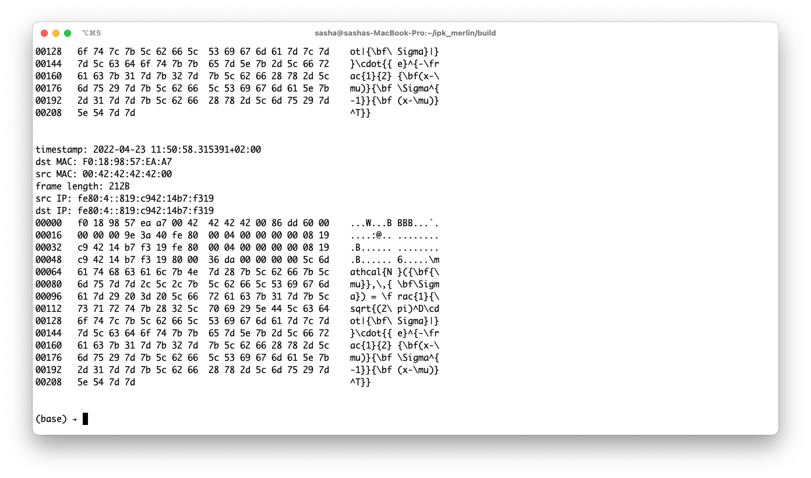

# Zniffer by [Skuratovich Aliaksandr](https://github.com/SkuratovichA)
> Author: Skuratovich Aliaksandr <xskura01@vutbr.cz>
> Date: 24.4.2022

## _Light-weight packet sniffer && script for generating the packets_
---
Zniffer is a light weight UNIX-like platform independent commandline-driven packet sniffer implemented in c++.

### Features
* specify the parameters such as network interface, port and many more in commandline
* wait until packets are captured
* read necessary information about the captured packets

### Libraries
Libraries used in the project are:
*  [pcap](https://github.com/the-tcpdump-group/libpcap)
* c++ standard library


### Installation
1. Clone the repository
```bash
git clone https://github.com/SkuratovichA/ipk2 && cd ipk2
```
2. Make folder where binaries and build files will be stored
```bash
mkdir build
```
3. Run `CMake` application to create a `Makefile`
```bash
cmake ../
```
4. Run make command to compile binaries.
```bash
make
```


### Running
> Note: To run this program, you should have sudo priveleges.
```bash
sudo ./ipk_sniffer [parameters]
```
Where `[parameters]` can be:
* `[-i|--interface] interface` one interface packets will be sniffed on.
    - If not provided or is provided without a value, a list of active interfaces is printed and program terminates.
* `-p port` packets will be filtered on the interface w.r.t. port
    * If not provided, all ports are used.
    * If provided, ports are used both from src and dst.
* `[--tcp|-t]` TCP packets are shown.
* `[--udp|-u]` UPD packets are shown.
* `[--arp]`  ARP packets are shown.
* `[--icmp]` ICMP packets are shown.
    * If no option for protocol is provided, all packets are being captured.
* `-n num` number of sniffed packets.
    * If not provided, only one packet is captured.


### Examples
1. Capture 2 `TCP` packets on interface `en0`:
   

5. Capture 10 `ICMP` packets on port `42690`.
   
   You can see, these is no packets here.
   For these purposese, `PyPaGen.py` was implemented.

## PyPaGen.py
### _Python script for generating the packets_
---
### Instalation
1. Clone the repository
```sh
git clone https://github.com/SkuratovichA/ipk2 && cd ipk2
```
2. Go to `tests/` directory
```sh
cd tests
```
3. Install `python3.10`
4. Install required packages.
```sh
pip install -r requirements
```
or using conda:
```sh
conda create --name pypagen python=3.10
conda activate pypagen
conda install -r requirements.txt
```


### Running
```bash
python PyPaGen.py [parameters]
```
Where the `[parameters]` can be:
* `[-h|--help]` show this help message and exit
* `--protocol PROTOCOL`  Protocol string. One of `ARP`, `IPV{4,6}`, `UDP`, `TCP`. If not specified, 'ipv4' is used.
*  `--port PORT` - Port number. If not specified, 42690 is used.
*  `--interface INTERFACE` Interface.If not specified, en0 is used.
*  `--count COUNT` Number of accepted packets. If not specified, 42 packets are sent.
*  `--msg MSG` Message in packet data. If not specified, _"tristatriatricet stribrnych paketu preletelo pres tristatriatricet stribrnych rozhrani"_ is added to the packet data.

### Examples
1. Create 1000000 `IPV4` packets with message `"=\=\=\=\=\=\=\=DDOSED_DDOSED_DDOSED_DDOSED\=\=\=\=\=\=\=\="`
   
   
3. Create 100 `IPV6` packets on interface `en0` and message `"Neural networks is just a well sold linear algebra. We can compare every system with brain. Even studid linear algebra and matrix multiplication. Oh, wait..."`
   


4. Create 10 IPV6 packets with multivariate gaussian distribution.
   equation for multivariate gaussian distribution in latex:
   ```math
   \mathcal{N}({\bf{\mu}},\,{\bf\Sigma}) = \frac{1}{\sqrt{(2\pi)^D\cdot|{\bf\Sigma}|}}\cdot{{e}^{-\frac{1}{2}{\bf(x-\mu)}{\bf\Sigma^{-1}}{\bf(x-\mu)}^T}}
   ```
   And plaintext representation is:`\mathcal{N}({\bf{\mu}},\,{\bf\Sigma}) = \frac{1}{\sqrt{(2\pi)^D\cdot|{\bf\Sigma}|}}\cdot{{e}^{-\frac{1}{2}{\bf(x-\mu)}{\bf\Sigma^{-1}}{\bf(x-\mu)}^T}}`
   
